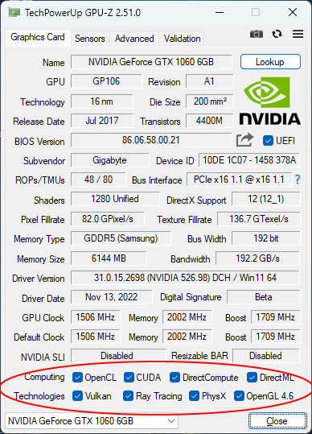

# NVIDIA patched drivers

Adds 3D acceleration support for P106-090 / P106-100 / P104-100 / P104-101 / P102-100 / CMP 30X / CMP 40X / CMP 50X / CMP 70X / CMP 90X mining cards.

## Usage
[Click here](https://mysku.club/blog/taobao/70663.html) if you need Russian translation.

1. Download patched files from [releases](https://github.com/dartraiden/NVIDIA-patcher/releases).
2. Download the official driver package from the NVIDIA website.
3. Download [Display Driver Uninstaller](https://www.wagnardsoft.com/display-driver-uninstaller-ddu-) (DDU).
4. Unpack the official driver package with 7-Zip / WinRAR / etc.
5. Replace original files with patched ones.
6. Unplug the network cable / disable Wi-Fi on your PC and clean the installed NVIDIA driver with DDU. Reboot PC.
7. Run Install.bat as admin.

Result:

Now you can plug the network cable / enable Wi-Fi back.

## SLI hack
It is possible to pair together different GPUs of similar generation/architecture to work together in SLI (Note: Mixing different VRAM sizes may cause some instability or stop SLI from functioning properly). It can also enable SLI on some non SLI/Crossfire compatible motherboards, making it a replacement for the now discontinued HyperSLI program (Note: The SLI support on non multi-GPU motherboards is not guaranteed).

Mandatory requirements:
* Driver version 446.14 (exactly this version)
* The first three symbols of Device ID for both cards must match. Go to Windows Device Manager → Right-click on device → Properties → Switch to the "Details" tab →  Select "Hardware IDs" from the combo box.

As an example:  
NVIDIA_DEV.**118**5.098A.10DE = "NVIDIA GeForce GTX 660"  
NVIDIA_DEV.**118**5.106F.10DE = "NVIDIA GeForce GTX 760"

Thus, for example, GTX 1070 and GTX 1080 can work together, but GTX 960 and GTX 1060 cannot.
